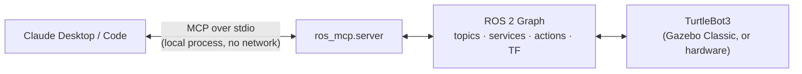
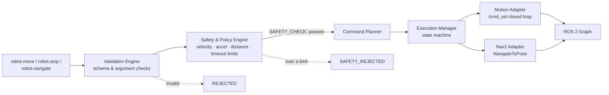
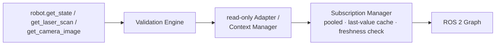
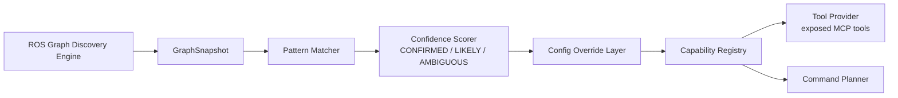
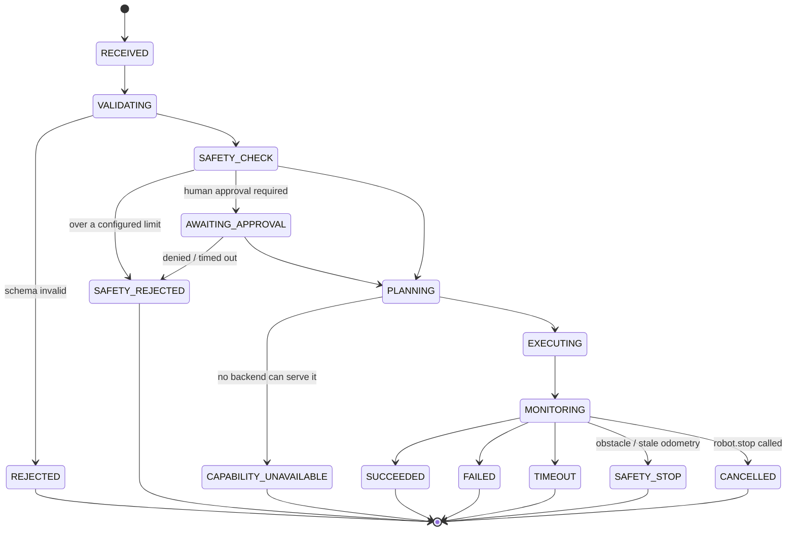

# ROS-MCP-Server

A stable semantic robotics API, exposed over MCP, backed by an unmodified ROS 2 graph.
Claude reasons in terms of `robot.move`, `robot.navigate`, `robot.get_state`, …; the
server discovers what a given robot actually supports and translates those calls into
the right ROS 2 mechanism — `/cmd_vel`, Nav2, a sensor topic — with a deterministic
safety layer the LLM cannot bypass.

The full architecture (design principles, frozen contracts, ADRs, safety model) lives
in [`docs/`](docs/00-overview.md). This file covers running the MVP.

## How It Works

### 1. One local process, two runtimes

Claude talks to the server over MCP **stdio** — a local subprocess pipe, not a network
socket ([ADR-014](docs/adr/ADR-014-mcp-transport-and-robot-identity.md)). Inside that
one process, an `asyncio` runtime (MCP + business logic) and an `rclpy` executor thread
(ROS 2) run side by side, joined only through a thread-safe bridge — ROS callbacks never
block on MCP work, and MCP handlers never block on ROS calls.



### 2. Every actuating command passes through one gate

`robot.move`, `robot.stop`, and `robot.navigate` are the only tools that can make the
robot move, and every one of them is forced through the same pipeline — there is no
second, shorter code path from a tool call to a ROS publish or action goal. This is the
project's **Non-Bypass Rule**
([docs/10-safety-and-trust.md](docs/10-safety-and-trust.md)):

> The LLM is never trusted to directly control actuators. Every MOTION-class command
> passes through a deterministic Safety & Policy Engine the MCP tool-handling code path
> cannot bypass — enforced by construction: the Execution Manager's only entry point for
> dispatch requires a command already stamped `SAFETY_CHECK: passed`.



A move that exceeds a configured limit (e.g. distance beyond `max_move_distance_m`)
comes back `SAFETY_REJECTED` with **zero** messages published to `/cmd_vel` — verified
directly, not just by reading the code (`acceptance/RESULTS.md`, criterion 8).

### 3. Reads don't need the safety gate — there's nothing to actuate

`robot.get_state`, `robot.get_laser_scan`, and `robot.get_camera_image` skip the Safety
& Policy Engine and the command state machine entirely (docs/06: READ-class commands
"route directly to the relevant read-only adapter"). They're served from the
**Subscription Manager**'s pooled, last-value cache rather than a fresh subscribe per
call, so a burst of reads doesn't multiply ROS subscriptions or return stale data
silently — freshness is checked and reported (`data_age_s`, `stale`) on every result.



### 4. The tool list reflects what the robot actually has

On startup (and whenever the graph changes), a Discovery Engine walks the live ROS 2
graph and scores each candidate capability's confidence
(`CONFIRMED` / `LIKELY` / `AMBIGUOUS`,
[docs/03-capability-discovery.md](docs/03-capability-discovery.md)). Only
`CONFIRMED`/`LIKELY` capabilities unlock the matching MCP tool — `AMBIGUOUS` stays
registered (visible via `robot.get_capabilities`) but hidden from the callable tool
list. No robot present → zero capabilities, zero motion/navigation/perception tools,
and the server still starts cleanly rather than crashing.



### 5. Every command's lifecycle is an explicit state machine

No command result is ever a bare "OK" or a guess at what happened — every `robot.move`
or `robot.navigate` call is tracked through an explicit `ExecutionState` from receipt to
a terminal state, so `CANCELLED`, `TIMEOUT`, and `SAFETY_STOP` are first-class outcomes,
not exceptions.



### The 8-tool MVP surface

| Tool | Class | What it does |
|---|---|---|
| `robot.get_capabilities` | READ | What this robot can currently do |
| `robot.get_state` | READ | Pose, velocity, active command |
| `robot.move` | MOTION | Closed-loop relative move against `/cmd_vel` + odometry |
| `robot.stop` | MOTION | Cancel in-flight command, zero velocity immediately |
| `robot.navigate` | MOTION | Absolute-goal navigation via Nav2 |
| `robot.get_laser_scan` | READ | Nearest/farthest obstacle, by sector |
| `robot.get_camera_image` | READ | Latest frame as a downsized JPEG thumbnail |
| `robot.detect_objects` | READ | Labeled objects + estimated position (MVP: stub detector) |

Plus three MCP resources: `robot://state`, `robot://capabilities`, `robot://graph-summary`.

## Requirements

- ROS 2 Humble (sourced), Python 3.10
- `turtlebot3_gazebo` (or another robot with the topics/action named in
  [`config/robot.yaml`](config/robot.yaml))
- Python packages: `mcp`, `pydantic`, `numpy`, `pyyaml`, `Pillow` (see
  [`pyproject.toml`](pyproject.toml))

## Setup

```bash
source /opt/ros/humble/setup.bash
cd ros2-mcp-server
python3 -m pip install --user mcp pydantic numpy pyyaml Pillow
python3 -m pytest tests/ -q                       # should show "N passed", ROS mocked
python3 -m ros_mcp.server --config config/robot.yaml   # starts even with no robot present
```

If `python3 -m ros_mcp.server` reports `No module named 'ros_mcp'`, either
`pip install -e .` (needs `setuptools>=64` for a PEP 660 editable install) or add
`src/` to `PYTHONPATH` — `examples/run_server.sh` does the latter automatically and is
what the Claude Desktop config below actually launches.

## Connect Claude Desktop

1. Copy the `mcpServers` entry from [`examples/claude_desktop_config.json`](examples/claude_desktop_config.json).
2. Point its `command` at this repo's `examples/run_server.sh` (absolute path).
3. Set `ROS_DISTRO_SETUP` if your ROS setup script isn't `/opt/ros/humble/setup.bash`.
4. Restart Claude Desktop.
5. Ask it to move the robot, navigate somewhere, or describe what it sees.

`run_server.sh` sources ROS and execs the server — Desktop launches MCP servers with no
ROS environment of their own, so a bare `python -m ros_mcp.server` command won't work.

## Reference Robot

[`config/robot.yaml`](config/robot.yaml) targets TurtleBot3 (Waffle) under
`turtlebot3_gazebo`: `/cmd_vel`, `/odom`, `/scan`, `/camera/image_raw`, `/tf`, and,
when Nav2 + AMCL are also running, `/navigate_to_pose` + `/amcl_pose`. Discovery infers
capabilities from whatever is actually present — the tool list degrades cleanly
(`robot.navigate` simply doesn't appear, or returns `CAPABILITY_UNAVAILABLE`) when Nav2
or localization isn't running, and `robot.move`/`robot.stop`/the read tools work with
just the sim's base topics.

TurtleBot3's TF tree uses `base_footprint` as the moving base frame (`base_link` is a
static child of it), not the `base_link` name the docs use generically — set
`ROS_MCP_BASE_FRAME=base_footprint` (already in `run_server.sh`'s env for this repo) if
you run against a different platform that does use `base_link` directly, leave it unset.

## Tests

```bash
python3 -m pytest tests/ -q                                              # unit suite, ROS mocked
MYPYPATH=src python3 -m mypy -p ros_mcp                                  # type check
MYPYPATH=src:tests python3 -m mypy -p tests.typecheck.protocol_conformance  # Protocol conformance
```

The unit suite needs no live ROS graph. `tests/typecheck/protocol_conformance.py` is
not collected by pytest; it's a static check (each concrete class assigned to a
variable typed as its frozen `docs/13-contracts.md` Protocol, verified by mypy since
only `CancellationToken` is `@runtime_checkable`).

Live-robot testing (`get_state`, `get_laser_scan`, `move`, `stop`, `navigate`) requires
`turtlebot3_gazebo` running and, for `navigate`, Nav2 + AMCL with an initial pose set
(`ros2 topic pub /initialpose ...` once, or set it in RViz). A Docker-based version of
this (sim + server, no host ROS install needed) lives in [`docker/`](docker/); a full
run's measured results — displacement error, stop latency, safety-rejection evidence —
are in [`acceptance/RESULTS.md`](acceptance/RESULTS.md).
