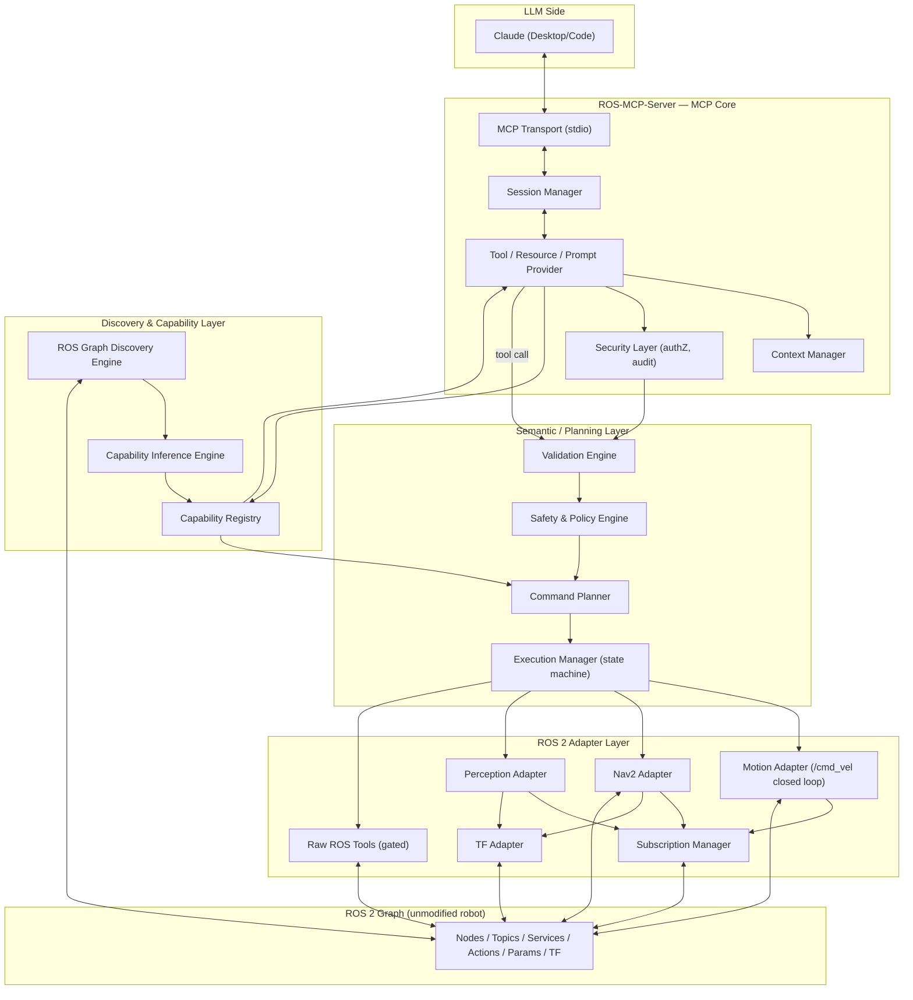
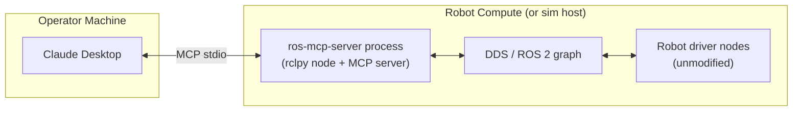

# 01 — System Architecture

## Component List

| Component | Responsibility | Why it exists as a separate module |
|---|---|---|
| **MCP Transport** | Owns the stdio (MVP) / future HTTP+SSE connection to the MCP client. Frames JSON-RPC. | Transport concerns (framing, reconnect) must not leak into tool logic. |
| **MCP Session Manager** | One session per connected client; holds session ID, capability snapshot version, subscriptions the client has open. | Lets one server process eventually serve more than one client without cross-talk. |
| **Capability Registry** | Holds the current set of inferred + configured robot capabilities and their confidence. | Single source of truth for "what can this robot do" — read by both MCP tool generation and the command planner. |
| **MCP Tool/Resource/Prompt Provider** | Turns registry entries into the live MCP tool list, resource list, and prompt list. | Isolates "MCP protocol shape" from "what the robot can do." |
| **ROS Graph Discovery Engine** | Walks the live ROS 2 graph (nodes, topics, types, services, actions, params, TF) on startup and on change. | The only component allowed to call `rclpy` graph-introspection APIs directly. |
| **Capability Inference Engine** | Maps discovered ROS interfaces onto the semantic ontology with a confidence score. | Keeps "ROS interface → meaning" logic out of both discovery (mechanical) and registry (storage). |
| **Command Planner** | Turns a semantic command into a choice of backend (e.g. `NAVIGATE` → Nav2 if healthy, else `MOVE` fallback if configured). | Backend selection is a policy decision, not something buried in an adapter. |
| **Safety & Policy Engine** | Validates every semantic command against limits, geofence, command class, approval policy — before execution. | Must be a single mandatory choke point the LLM path cannot bypass. |
| **Validation Engine** | Schema/type/range validation of tool arguments and semantic command fields. | Cheap, stateless, ordered before the (stateful) safety engine. |
| **Execution Manager** | Owns the semantic command state machine, dedupes by command ID, dispatches to adapters, tracks in-flight commands, handles cancellation. | The only component that mutates command execution state. |
| **Motion Adapter** | Closed-loop `/cmd_vel` control against odometry + laser scan. | Encapsulates the one place raw velocity is published. |
| **Nav2 Adapter** | `NavigateToPose`/`NavigateThroughPoses` action client, feedback, cancellation. | Encapsulates Nav2-specific action/message shapes. |
| **Perception Adapter** | LaserScan reasoning, camera acquisition, plugin-based object detection, TF-based geometric grounding. | Perception has its own freshness/caching/plugin concerns distinct from control adapters. |
| **TF Adapter** | `tf2_ros` Buffer/Listener wrapper; frame lookups and transforms with staleness checks. | Shared dependency of navigation and perception; owning it once avoids duplicate listeners. |
| **Subscription Manager** | Pools ROS subscriptions, maintains a last-value cache with timestamps, enforces freshness policy, throttles delivery. | Prevents "one subscription per MCP request" and "30 FPS into the LLM." |
| **Context Manager** | Hierarchical, lazy exposure of robot state/capabilities to the LLM; compresses/caches; tracks freshness. | Prevents dumping the full ROS graph into LLM context. |
| **Event/Streaming Bridge** | Converts ROS action feedback / topic events into MCP notifications for in-flight commands. | Decouples "ROS callback thread" from "MCP notification delivery." |
| **Plugin Manager** | Discovers, registers, configures, health-checks plugins (adapters, detectors). | Extensibility point without touching core. |
| **Config Provider** | Loads and validates `robot.yaml` + env overrides into typed config; supplies overrides to discovery/inference. | Single typed config surface, no scattered `os.environ` reads. |
| **Telemetry Subsystem** | Structured logs, metrics, traces, command audit log. | Cross-cutting; must not be threaded manually through every module. |
| **Security Layer** | AuthN/AuthZ of the MCP client, tool-level permission checks, audit log write path. | Distinct from robot safety — this is about *who* may ask, safety is about *what* may be done. |

## System Architecture Diagram

## Deployment Boundary

The ROS-MCP-Server process runs **on the robot's own compute** (or a machine on the same
`ROS_DOMAIN_ID`/DDS network), as a normal ROS 2 participant. Claude Desktop/Code runs on
the operator's machine and talks to the server over MCP stdio (local process) — remote
MCP transports are a post-MVP extension (see [14-multi-robot.md](14-multi-robot.md)).

See [ADR-011](adr/ADR-011-async-boundary.md) for why the rclpy executor and the MCP
asyncio loop are two isolated runtimes inside this one process.
