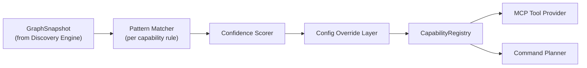

# 03 — Capability Discovery & Ontology

## Ontology

A small, fixed taxonomy of semantic capabilities. Each capability has a stable string ID,
a required-interface pattern, and the MCP tools it unlocks.

| Capability ID | Meaning | Inferred from (default patterns) | Unlocks tools |
|---|---|---|---|
| `differential_drive_motion` | Can be commanded by planar velocity | publisher expected on `geometry_msgs/msg/Twist` (or `TwistStamped`) topic (default `/cmd_vel`) **and** an odometry source (`nav_msgs/msg/Odometry` topic, default `/odom`, **or** a TF chain `odom→base_link`) | `robot.move`, `robot.stop` |
| `autonomous_navigation` | Can be given a goal pose and drive there autonomously | `NavigateToPose` (and optionally `NavigateThroughPoses`) action servers present (default `/navigate_to_pose`) | `robot.navigate` |
| `localization` | Has a `map`→`odom` (or `map`→`base_link`) transform, i.e. knows where it is in `map` frame | TF frame `map` connected to `base_link`/`odom`, or `/amcl_pose`-shaped topic present | gates `robot.navigate` and any `frame: map` target |
| `range_sensing` | Has a planar range sensor | `sensor_msgs/msg/LaserScan` publisher (default `/scan`) | `robot.get_laser_scan`, contributes to `robot.detect_nearest_object` |
| `visual_observation` | Has a camera | `sensor_msgs/msg/Image` or `CompressedImage` publisher, ideally paired with `sensor_msgs/msg/CameraInfo` | `robot.get_camera_image` |
| `object_detection` | Can produce labeled objects with positions | `visual_observation` **and** at least one registered `ObjectDetectorPlugin` | `robot.detect_objects` |
| `manipulation` | Has an arm | MoveIt `move_group` action servers present | *(post-MVP)* `robot.move_arm`, `robot.grasp` |
| `docking` | Can dock/undock | robot-specific action/service matching configured docking pattern | *(post-MVP)* `robot.dock` |
| `diagnostics` | Reports health | `diagnostic_msgs/msg/DiagnosticArray` on `/diagnostics`, or node liveness alone | `robot.diagnose` (always available at minimum via node liveness) |

The ontology is intentionally small (§20/41 of the mega-spec: "do not assume every
`/cmd_vel` means exactly the same thing" is handled by **confidence + config**, not by
growing the ontology to cover every edge case).

## Inference Process

1. **Pattern Matcher**: for each ontology entry, check whether the required interface
   shapes exist anywhere in the `GraphSnapshot`, using the *default* topic/action names
   as a first guess.
2. **Confidence Scorer**: assigns a score in `{CONFIRMED, LIKELY, AMBIGUOUS}`:
   - `CONFIRMED` — interface exists at the exact default name with matching type, or an
     explicit config mapping names it.
   - `LIKELY` — interface of the right type exists but at a non-default name, with no
     other equally-plausible candidate (e.g. exactly one `Twist` publisher topic in the
     whole graph).
   - `AMBIGUOUS` — multiple equally-plausible candidates exist (e.g. two `LaserScan`
     topics), or the type matches but naming/namespace gives no signal.
3. **Config Override Layer**: `robot.yaml` entries under `capabilities:` always win over
   inference, at any confidence level — see [16-configuration.md](16-configuration.md).
   This is the explicit answer to "do not become dangerously speculative": inference
   *proposes*, config *resolves* ambiguity, and `AMBIGUOUS` capabilities without a config
   override are registered but **excluded from the MCP tool list** until resolved
   (they still appear in the `robot.get_capabilities` resource so a human/operator can see
   what needs disambiguation).
4. Registry entries are versioned (`snapshot_version` monotonic counter); the Tool
   Provider re-publishes the MCP tool list (`tools/list_changed`) only when the *set* of
   `CONFIRMED`/`LIKELY` capabilities changes, not on every discovery poll.

## Non-Speculation Rule (hard constraint)

A capability at `AMBIGUOUS` confidence **never** becomes an executable MCP tool
automatically. This is enforced in the Tool Provider (§[04](04-mcp-surface.md)), not by
convention — see [ADR-003](adr/ADR-003-capability-inference-with-confidence.md).

## Capability Registry Contract

See [13-contracts.md](13-contracts.md) `CapabilityRegistry` — read-heavy, single-writer
(Inference Engine), snapshot-versioned, safe to read concurrently from the asyncio side
via an immutable snapshot handoff (no shared mutable dict crossing the rclpy/asyncio
boundary — ADR-011).
