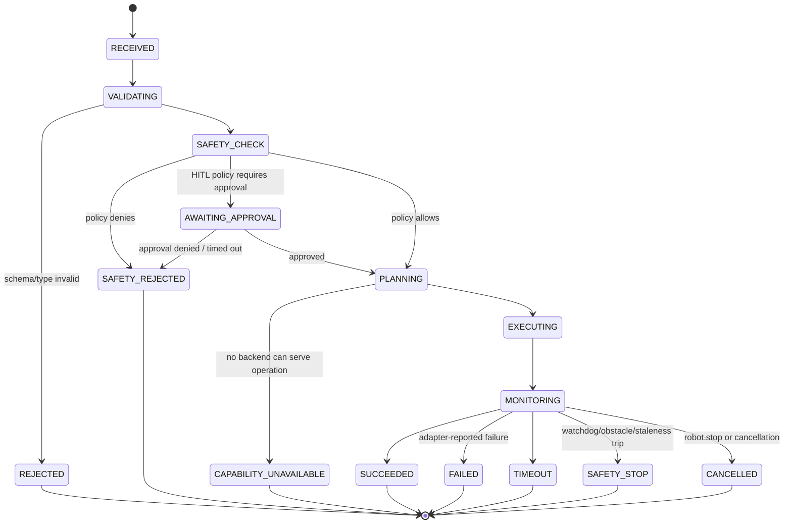

# 06 — Execution Architecture

## State Machine

A plain, explicit state machine — not a general workflow engine. Robot commands are
short-lived, single-entity, and the state set is small and known; a workflow engine would
add operational complexity (persistence, DAG scheduling) the MVP does not need. Revisit
only if/when multi-step orchestrated workflows (§[04 Prompts](04-mcp-surface.md),
[20-roadmap.md](20-roadmap.md) Phase 4) demand it (see
[ADR-004](adr/ADR-004-semantic-command-and-state-machine.md)).



Terminal states map directly onto `ToolResult.status` (§[13](13-contracts.md)):
`SUCCEEDED → "succeeded"`; every other terminal state → `"failed"` with a structured
`error.code` matching the state (or a more specific sub-reason, e.g.
`NAVIGATION_FAILED` under `FAILED`) — see [Error Model](15-observability-and-failure-handling.md).

## Execution Manager Responsibilities

1. **Single mutator of execution state.** No adapter, tool handler, or telemetry code
   writes `execution_state` directly; they report outcomes to the Execution Manager,
   which transitions the state machine. This keeps state transitions auditable in one
   place.
2. **Idempotency / dedup.** Keyed by `command_id`. If the same `command_id` arrives while
   a prior identical submission is still `EXECUTING`/`MONITORING`, the Execution Manager
   returns the **same in-flight future** rather than dispatching twice — it never issues
   a second `/cmd_vel` sequence or a second Nav2 goal for one logical command. Clients
   (including retry logic in the MCP transport layer) are expected to reuse
   `command_id` on retry; the tool layer generates one `command_id` per *logical* call
   and is responsible for not minting a new one on transport-level retry of the same
   request. Two *distinct* tool calls (even with identical arguments) get distinct
   `command_id`s and both execute — this is deliberate: "move forward 1m" issued twice by
   the user means move 2m total, not one no-op.
3. **In-flight registry.** Bounded map `command_id → SemanticCommand` for active commands,
   used by `robot.stop` (cancels the active `MOTION`-class command for the session) and by
   `robot.get_state`'s `active_command` field.
4. **Cancellation.** Sets a `cancellation_token` an adapter's control loop polls at each
   iteration (motion loop tick, Nav2 feedback callback). Adapters must check this token at
   a bounded interval (≤ one control-loop period) — this is a contract requirement, not a
   suggestion (§[13](13-contracts.md) `Adapter.execute` contract).
5. **Priority pre-emption.** A `SAFETY`-priority command (only ever `STOP`, or an internal
   watchdog-triggered stop) cancels any `NORMAL`-priority command for the same
   `robot_id` before executing.
6. **Timeout enforcement.** Owns a monotonic deadline per command derived from
   `timeout_s`; on expiry, transitions to `TIMEOUT` and signals cancellation to the
   adapter — the Execution Manager does not trust adapters to self-timeout, though
   adapters are additionally required to enforce it internally (defense in depth, see
   [07](07-motion-architecture.md)/[08](08-navigation-architecture.md)).

## Command Planner

Sits between Safety Check and Execution. Maps `operation` → concrete adapter using the
Capability Registry:

```text
NAVIGATE → is `autonomous_navigation` CONFIRMED/LIKELY and `localization` present?
             yes → Nav2Adapter
             no  → CAPABILITY_UNAVAILABLE  (MVP: no silent fallback to MOVE for NAVIGATE —
                                             an absolute-frame goal is not safely
                                             reinterpretable as a relative /cmd_vel motion)
MOVE     → is `differential_drive_motion` CONFIRMED/LIKELY?
             yes → MotionAdapter
             no  → CAPABILITY_UNAVAILABLE
STOP     → always routes to MotionAdapter.stop() AND Nav2Adapter.cancel_all() —
           stop is broadcast to every adapter capable of motion, not planned.
GET_*    → routes directly to the relevant read-only adapter/Context Manager;
           these bypass Safety Check (READ class) but still go through Validation.
```

The Planner is deliberately the **only** place that knows "prefer Nav2 for absolute
goals, cmd_vel for relative moves" — this policy is documented, not hidden in an
adapter's `can_handle()` guess (see [ADR-005](adr/ADR-005-cmdvel-closed-loop-vs-nav2.md)).

## Execution Pipeline (per command)

```mermaid
sequenceDiagram
    participant Tool as MCP Tool Handler
    participant Val as Validation Engine
    participant Safety as Safety & Policy Engine
    participant Plan as Command Planner
    participant Exec as Execution Manager
    participant Adapter as Motion/Nav2 Adapter

    Tool->>Val: SemanticCommand (RECEIVED)
    Val->>Val: schema/type/range check
    alt invalid
        Val-->>Tool: REJECTED (INVALID_ARGUMENT)
    else valid
        Val->>Safety: VALIDATING → SAFETY_CHECK
        Safety->>Safety: command-class policy, limits, geofence, HITL rule
        alt denied
            Safety-->>Tool: SAFETY_REJECTED
        else approval required
            Safety-->>Tool: AWAITING_APPROVAL (async; resumes on approval)
        else allowed
            Safety->>Plan: PLANNING
            Plan->>Plan: select adapter from Capability Registry
            alt no backend
                Plan-->>Tool: CAPABILITY_UNAVAILABLE
            else backend selected
                Plan->>Exec: dispatch
                Exec->>Adapter: EXECUTING → execute(command, cancellation_token)
                Adapter-->>Exec: MONITORING (progress/feedback, streamed)
                Adapter-->>Exec: terminal outcome
                Exec-->>Tool: SUCCEEDED / FAILED / TIMEOUT / SAFETY_STOP / CANCELLED
            end
        end
    end
```

## Why a State Machine (Not Bare Async Functions)

Bare `async def execute_move(...)` per tool would scatter cancellation, timeout, and
audit logic across every adapter with no shared enforcement point, and would make
"what is the robot doing right now" (needed by `robot.get_state` and by `robot.stop`)
an ad-hoc query instead of a registry read. The explicit state machine gives one place to
answer "can this command be cancelled right now" and "what does SAFETY_STOP mean" for
every operation uniformly.
