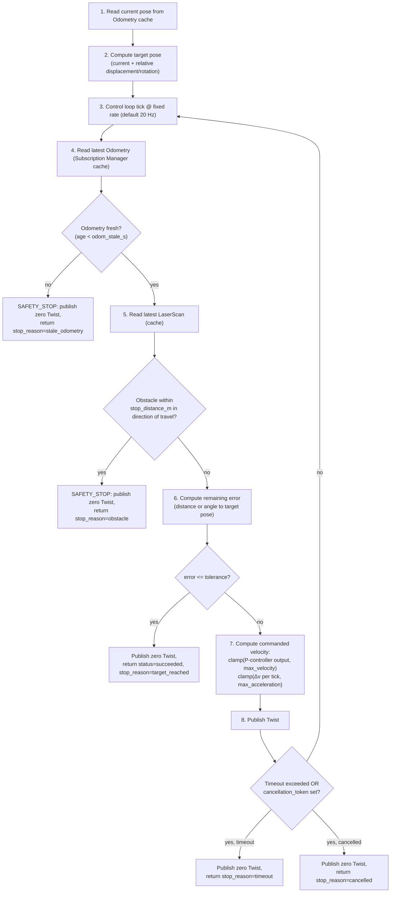

# 07 — Motion Architecture (`/cmd_vel` Closed Loop)

## Why Blindly Publishing `/cmd_vel` Is Unsafe

Publishing a fixed `Twist` for a computed duration ("2 m at 0.2 m/s ⇒ publish for 10 s")
is unsafe because:

- **Odometry drift and wheel slip** mean elapsed-time-based distance is wrong, often by
  more than the tolerance a human would accept ("stop within 10 cm").
- **No obstacle awareness** — a fixed-duration publish drives through anything in the
  way.
- **No liveness guarantee** — if the MCP session dies, the process hangs, or the
  publishing coroutine is cancelled mid-loop without an explicit final zero-`Twist`, the
  robot keeps moving on the last published message (most `Twist` consumers have no
  built-in command-timeout unless the robot's own driver implements one, which zero-mod
  cannot assume).
- **No acceleration limiting** — a step change to target velocity can exceed the
  platform's safe jerk, especially with a payload.
- **Unbounded by construction** — "publish for N seconds" has no external stop condition;
  every failure mode above compounds because nothing is watching.

The motion adapter must therefore be a **closed control loop with continuous feedback**,
not an open-loop timed publish.

## Closed-Loop Control Algorithm

### Step Detail

1. **Current pose** comes from the Subscription Manager's last-value cache for `/odom`
   (never a fresh subscription per command — §[13](13-contracts.md)
   `SubscriptionManager`). If no odometry has ever arrived, the command fails fast with
   `SENSOR_STALE` before any publish.
2. **Target pose** is computed once, in the odometry frame the current pose was read in
   (not `map` — `robot.move` is explicitly relative/local motion; absolute goals go
   through `robot.navigate`/Nav2). Rotation-only moves (`rotate_left/right`) hold position
   and target only heading.
3. **Control loop tick**: fixed-rate `asyncio` loop (default 20 Hz, configurable), running
   in the MCP-side asyncio runtime — it *reads* rclpy-side caches (thread-safe snapshot
   handoff, ADR-011) and *writes* by calling a thread-safe publish handle; it does not run
   inside an rclpy callback.
4. **Freshness check**: `odom_stale_s` (default 0.5 s) — if the last odometry sample is
   older, this is treated identically to a sensor failure: stop and fail, never coast on
   stale data.
5. **Obstacle check**: reads the LaserScan cache's front-sector nearest-range (reusing
   §[09](09-perception-architecture.md) sector logic); if closer than
   `obstacle_stop_distance_m` (default 0.3 m) in the direction of current travel, stop.
   This is a safety backstop, not a replacement for Nav2's costmap-based planning — hence
   `robot.move` is for short, supervised relative motions, and `robot.navigate` is
   preferred whenever Nav2 is available (Planner policy, §[06](06-execution.md)).
6. **Error computation**: Euclidean distance remaining (translation moves) or shortest
   angular distance remaining (rotation moves).
7. **Velocity command**: a simple proportional controller toward zero error, with two
   independent clamps applied in order — velocity magnitude clamp (`max_linear_mps` /
   `max_angular_rps` from resolved `safety_constraints`), then per-tick delta clamp
   derived from `max_linear_acceleration_mps2` / `max_angular_acceleration_rps2` so the
   command never steps discontinuously from the previously published value.
8. **Publish**: one `Twist` per tick via a long-lived publisher (created once at adapter
   init, not per command).
9. **Exit conditions checked every tick, in priority order**: cancellation >
   safety-stop (stale odom / obstacle) > timeout > target reached. Every exit path
   publishes an explicit zero `Twist` before returning — there is no code path that
   returns without a final stop command.
10. **Result reporting**: `MotionResult` always includes actual `distance_traveled_m`
    (integrated from odometry samples seen, not the requested distance) and `final_pose`,
    so the caller (LLM) can see when the outcome differs from the request (e.g. stopped
    early on obstacle at 0.6 m of a requested 2 m).

## Watchdog

Independent of the per-command loop: a low-rate (2 Hz) watchdog in the Motion Adapter
verifies that if *no* command is executing, `/cmd_vel` has not been publishing (guards
against a stuck loop task) and that the last-published `Twist`, if nonzero, is younger
than `cmd_vel_watchdog_s` (default 1.0 s) — if a control loop task ever dies without
reaching its own zero-publish exit (e.g. an unhandled exception), the watchdog publishes
a zero `Twist` and raises a `SAFETY_STOP` telemetry event. This is the last line of
defense described in [00-overview.md](00-overview.md) principle 3.

## Explicit Limits Enforced (from `robot.yaml`, resolved into `safety_constraints`)

- `max_linear_mps`, `max_angular_rps`
- `max_linear_acceleration_mps2`, `max_angular_acceleration_rps2`
- `max_move_distance_m` (validated at Safety Check, before any publish — exceeding it is
  `SAFETY_REJECTED`, not clamped-and-executed; see [10](10-safety-and-trust.md))
- `obstacle_stop_distance_m`
- `odom_stale_s`
- default and maximum `timeout_s` for `MOVE`

See [ADR-005](adr/ADR-005-cmdvel-closed-loop-vs-nav2.md) for the closed-loop-vs-Nav2
tradeoff and [ADR-002](adr/ADR-002-safety-engine-outside-llm.md) for why limits are
enforced here and cannot be raised by a tool argument.
