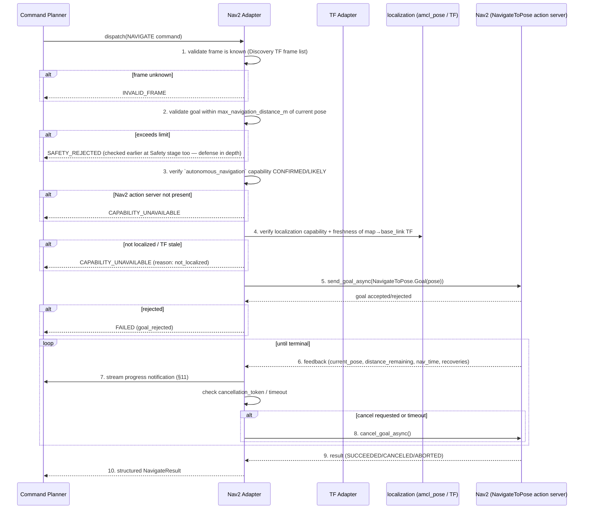

# 08 — Navigation Architecture (Nav2)

## Scope

`robot.navigate` is the only MVP tool backed by Nav2. It wraps the `NavigateToPose`
action. `NavigateThroughPoses`, planner/controller state introspection, and recovery
behavior tuning are modeled here for completeness but are **post-MVP** (see
[17-mvp.md](17-mvp.md)); the MVP adapter implements `NavigateToPose` + cancellation +
feedback only.

## Pipeline

### Step Detail

1. **Frame validation**: `target.frame` (default `"map"`) must be a frame the TF Adapter
   currently reports as connected to `base_link`; unknown/disconnected frame →
   `INVALID_FRAME` before touching Nav2 at all.
2. **Distance sanity check**: computed from current pose (map frame) to goal; checked
   again here even though Safety already checked it, because the Safety check used the
   pose known at validation time — this is defense-in-depth against pose drift between
   validation and dispatch, not a duplicate source of truth for the *limit value* itself
   (that always comes from `safety_constraints` resolved once, §[05](05-semantic-command-model.md)).
3. **Capability check**: `autonomous_navigation` must be `CONFIRMED`/`LIKELY` in the
   registry (i.e. the action server was seen at discovery time) — re-verified against the
   *current* action-server presence (a server can disappear after discovery), returning
   `CAPABILITY_UNAVAILABLE` cleanly rather than hanging on `send_goal_async` against a
   dead server.
4. **Localization check**: `localization` capability must be present and the
   `map`→`base_link` TF must be fresher than `tf_stale_s` (default 1.0 s). Sending a Nav2
   goal while unlocalized produces confusing/unsafe results, so this is checked
   explicitly rather than delegated to Nav2's own (less legible to the caller) failure
   mode.
5. **Goal submission**: standard `ActionClient.send_goal_async`, bridged into the
   awaitable used by the Execution Manager (ADR-011).
6. **Feedback**: Nav2 feedback (`current_pose`, `distance_remaining`, `navigation_time`,
   `number_of_recoveries`) is received on the rclpy callback thread and handed to the
   asyncio side via the same thread-safe bridge as goal futures — never processed inline
   in the rclpy callback beyond a cheap queue push.
7. **Streaming**: feedback is throttled (default 1 Hz, configurable) and forwarded as an
   MCP progress notification tied to `command_id` (§[11](11-context-and-streaming.md)) —
   the LLM is not required to poll `robot.get_state` in a loop to know navigation is
   progressing.
8. **Cancellation**: on `robot.stop`, on `timeout_s` expiry, or on `SAFETY` pre-emption
   from the Execution Manager, `cancel_goal_async()` is called and the adapter awaits the
   cancel confirmation before returning `CANCELLED`/`TIMEOUT`.
9. **Result mapping**: Nav2's `NavigateToPose.Result` + terminal `GoalStatus` are mapped
   into the structured outcome — `STATUS_SUCCEEDED → succeeded`,
   `STATUS_CANCELED → cancelled`, `STATUS_ABORTED → failed (fail_reason inferred from
   last feedback: stuck/recoveries exhausted ⇒ controller_failure; no plan found early
   ⇒ planner_failure)`.
10. **Result**: `NavigateResult` always includes `final_pose` (read fresh from odometry/TF
    at completion, not merely echoed from the last feedback message) so the caller gets a
    ground-truth final position.

## Why Not Expose Nav2 Internals to the LLM

Planner/controller plugin names, costmap layers, and recovery-behavior internals are
Nav2 implementation detail. The LLM needs "did it get there, and if not, roughly why"
(`fail_reason` enum) — not `bt_navigator` XML state. If deeper Nav2 introspection is
needed for diagnostics, it is exposed through `robot.diagnose` (post-MVP,
[20-roadmap.md](20-roadmap.md)) as a separate, explicitly diagnostic-flavored tool, not
folded into `robot.navigate`'s result.

## Why `robot.navigate` Never Falls Back to `/cmd_vel`

An absolute `map`-frame goal is not something the Motion Adapter can safely attempt — it
has no path planning or global obstacle knowledge. If Nav2 is unavailable, the correct
answer is `CAPABILITY_UNAVAILABLE` (so the LLM/user can decide to use `robot.move`
instead, with different, relative semantics) rather than a silent reinterpretation that
could drive the robot into something Nav2 would have avoided. See
[ADR-006](adr/ADR-006-nav2-first-class-clean-fallback.md).
