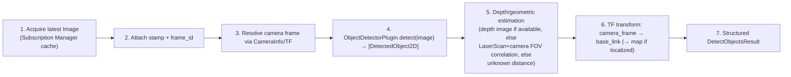

# 09 — Perception Architecture

## Laser Scan Reasoning

Input: `sensor_msgs/msg/LaserScan` from the Subscription Manager's last-value cache
(never a fresh subscription per call).

### Distinguishing Valid Obstacles From Artifacts

For each `ranges[i]`:

| Condition | Classification |
|---|---|
| `range_min <= ranges[i] <= range_max` and finite | valid measurement |
| `ranges[i] == +inf` (or `> range_max`, depending on driver convention) | **no obstacle detected** in that beam out to sensor max range — *not* an obstacle, and *not* an error; treated as "free up to `range_max`" for farthest-object queries, excluded from nearest-object queries |
| `ranges[i] == NaN` or `ranges[i] < range_min` | **invalid/artifact** — sensor dropout, too-close/specular reflection; excluded from all geometry calculations, counted in a `invalid_beam_count` diagnostic field |
| an isolated single-beam reading much closer than both neighbors (configurable delta) | flagged `possible_artifact: true` in raw output but **still included** in nearest-obstacle calculation — the system does not silently discard potentially-real thin obstacles (a chair leg) just because they're a single-beam spike; it annotates rather than deletes |

### Computed Fields (`LaserScanResult`)

- `nearest`: `{range_m, angle_rad, sector}` — global minimum over valid beams.
- `farthest`: `{range_m, angle_rad, sector}` — global maximum over valid, finite beams
  (an all-`inf` scan reports `farthest = null` with a note, since "farthest" is undefined
  when nothing was ever detected within range, distinct from "farthest = range_max").
- Per-sector (`front: -30°..30°`, `left: 30°..150°`, `right: -150°..-30°`,
  `rear: 150°..180° ∪ -180°..-150°`, configurable boundaries) nearest obstacle — this is
  what the Motion Adapter's obstacle check (§[07](07-motion-architecture.md)) and
  "nearest obstacle in front" queries both consume, so there is one sectoring
  implementation, not two.
- `data_age_s`: staleness relative to scan `header.stamp`; `robot.get_laser_scan` still
  returns data past `sensor_stale_s` but flags `stale: true` rather than erroring — a
  read-only diagnostic query about slightly old data is more useful returned-with-caveat
  than rejected outright (contrast with the Motion Adapter, which *does* hard-fail on
  stale odometry because it is actuating).

## Camera / Vision Pipeline

1. **Acquisition**: latest cached `Image`/`CompressedImage`, never a live 30 FPS
   subscription created per call (§[22](13-contracts.md) Subscription Manager contract).
2. **Timestamp/frame**: taken from `header.stamp`/`header.frame_id` of the source image,
   not wall-clock-at-request-time — this matters for TF lookups in step 6, which must use
   the image's own timestamp.
3. **Camera frame resolution**: from `CameraInfo` on the paired info topic when present;
   falls back to the image's own `frame_id`.
4. **Detection**: delegated entirely to a registered `ObjectDetectorPlugin`
   (§[12-plugin-architecture.md](12-plugin-architecture.md)). The MVP ships exactly one
   plugin, `StubDetector`, which returns a fixed/deterministic or trivially
   color-blob-based detection set — enough to validate the full pipeline
   (image → detection → geometry → TF → result) without depending on a GPU/model. It is
   registered behind the exact same `ObjectDetectorPlugin` interface a future
   YOLO/Grounding-DINO/VLM plugin would use, so swapping it requires zero changes above
   the plugin boundary.
5. **Depth/geometric estimation**: MVP uses LaserScan-camera FOV correlation where a
   depth source is absent (project the detected 2D bbox center angle into the robot's
   horizontal FOV, look up the LaserScan range at the corresponding bearing) — coarse but
   real, not fabricated. If a depth image is present (future robots/plugins), that takes
   precedence. If neither is available, `distance_m` is returned as `null` with
   `distance_source: "unavailable"` rather than a guessed number — no fabricated geometry
   ever ships in a result field.
6. **TF transform**: bearing/distance in the camera/robot frame is converted to
   `base_link` (and further to `map` if `localization` is present) via the shared TF
   Adapter, using the *image's* timestamp — if the transform is unavailable at that
   timestamp (extrapolation error, TF not yet warmed up), the object is still returned
   with `position: null` and `position_error: "TF_UNAVAILABLE"` rather than dropping the
   detection entirely.
7. **Result**: `DetectObjectsResult` per §[04](04-mcp-surface.md), including
   `detector_plugin_id` so the LLM/operator knows detection came from `StubDetector` and
   should not be treated as production-accurate.

## Binary Data Policy

MCP/JSON is not a substitute for ROS binary transport (§23 of the source design brief).
Rules, enforced uniformly by the `MessageCodec`/perception adapters:

- **Images**: never sent as raw `sensor_msgs/Image` byte arrays. `robot.get_camera_image`
  re-encodes to JPEG, downsamples to `max_width_px` (default 640, hard cap 1280), and
  returns it as an MCP image content block; `original_width_px/height_px` are reported
  separately so the LLM knows a thumbnail was substituted.
- **Point clouds**: not exposed as a tool in the MVP; when added (post-MVP,
  [20-roadmap.md](20-roadmap.md)) the same policy applies — voxel-downsampled summary +
  a size cap, never a raw multi-MB `PointCloud2` inlined into a tool result.
- **Any array-valued field** the generic `MessageCodec` schema walker (§[02](02-ros2-architecture.md))
  identifies as a byte-array/large-numeric-array type is, by default, **excluded** from
  generic (`ros.read_topic`) JSON conversion above a configurable element-count threshold
  (default 4096) and replaced with `{"truncated": true, "length": N, "note": "use a
  dedicated perception tool or raise element_limit explicitly"}`.
- **Hard size ceiling**: no single MCP tool result may exceed `max_result_bytes`
  (default 1 MiB, configurable) — enforced centrally at the `ToolResult` serialization
  boundary (§[13](13-contracts.md)), not per-adapter, so no adapter can accidentally
  violate it.

## Plugin Architecture for Detection

`ObjectDetectorPlugin` is the seam future YOLO / Grounding DINO / SAM / CLIP / VLM /
remote-inference/Isaac-perception integrations attach to — see
[12-plugin-architecture.md](12-plugin-architecture.md) and
[ADR-010](adr/ADR-010-perception-plugin-interface.md). The perception adapter itself
never imports a specific model library.
