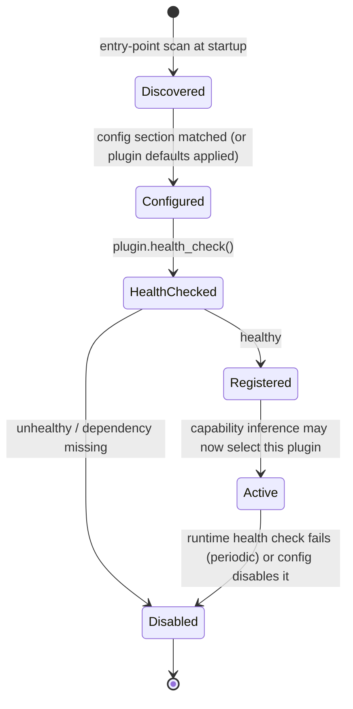

# 12 — Plugin Architecture

## Goals

A third party extends the system (a new detector, a new motion backend, a new robot
capability) without modifying core. Two plugin families exist:

- **Capability/Backend plugins** — implement one of the frozen adapter interfaces
  (`MotionBackend`, `NavigationBackend`, …, §[13](13-contracts.md)). MVP ships
  `CmdVelMotionPlugin` and `Nav2NavigationPlugin` as the reference implementations of
  this family — they are written as plugins from day one, not bolted on later, so the
  plugin boundary is proven by the MVP itself rather than aspirational.
- **Perception plugins** — implement `ObjectDetectorPlugin`. MVP ships `StubDetectorPlugin`.

## Plugin Lifecycle



1. **Discovery**: plugins register via a Python entry-point group
   (`ros_mcp.plugins.motion`, `ros_mcp.plugins.navigation`, `ros_mcp.plugins.perception`,
   …) discovered with `importlib.metadata.entry_points`. In-tree plugins (the MVP's own
   `CmdVelMotionPlugin`, `Nav2NavigationPlugin`, `StubDetectorPlugin`) are registered the
   same way — no special-casing of "built-in" vs. "third-party."
2. **Metadata**: each plugin exposes a `PluginMetadata` (id, version, the capability
   IDs it can satisfy, declared dependencies — e.g. "requires `nav2_msgs` importable,"
   "requires a `LaserScan`-typed topic") — checked before instantiation so a missing
   dependency is a clean `Disabled`, not an import-time crash of the whole server.
3. **Configuration**: `robot.yaml` may configure a plugin by id (§[16](16-configuration.md));
   unconfigured plugins run with their declared defaults.
4. **Health check**: `async def health_check(self) -> PluginHealth` — called once at
   startup and periodically (default 30 s) thereafter; a plugin that starts healthy and
   later fails transitions to `Disabled` and its capability is removed from the registry
   (tool list updates accordingly, §[03](03-capability-discovery.md)).
5. **Versioning**: `PluginMetadata.api_version` must match the core's supported plugin
   API version range (semver-style compatibility check, §[19](19-deployment-and-scalability.md));
   a mismatched plugin is disabled with a clear log message rather than crashing or
   silently misbehaving.

## Example Third-Party Shape (illustrative, not part of this repo)

```text
class MyRobotArmPlugin:
    metadata: PluginMetadata = ...
    async def health_check(self) -> PluginHealth: ...
    # implements ManipulationBackend from 13-contracts.md
```

Registered purely via entry points + config — zero edits to ROS-MCP-Server core.

## Which Interfaces Are Plugin Points (frozen in 13-contracts.md)

`MotionBackend`, `NavigationBackend`, `ObjectDetectorPlugin`, and (reserved, not
implemented) `ManipulationBackend`, `DockingBackend`. Discovery, Safety Engine,
Execution Manager, and the MCP surface itself are **not** plugin points — they are core
and stable, which is what keeps the LLM-facing tool surface consistent across every
robot regardless of which plugins are active (§[ADR-001](adr/ADR-001-semantic-tool-surface.md)).
