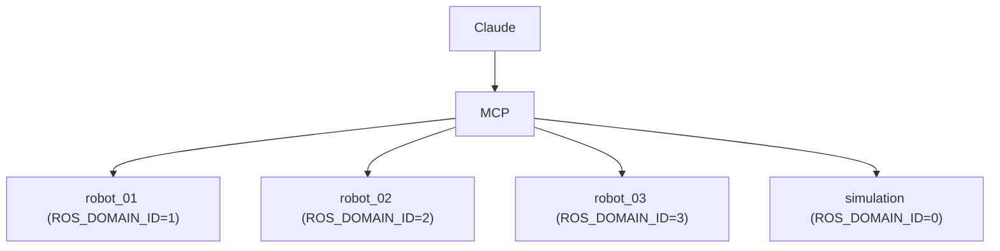

# 14 — Multi-Robot Architecture (Post-MVP, Designed For)

Not implemented in the MVP (single robot, single session, stdio transport — see
[17-mvp.md](17-mvp.md)). Documented now because the MVP's data model (`robot_id` on
every `SemanticCommand`, §[05](05-semantic-command-model.md)) is deliberately
multi-robot-ready from day one so this extension is additive.

## Target Shape

## Model

- **Robot identity**: `robot_id` is a config-assigned stable string, independent of ROS
  node names. A user saying "move robot 2 to the loading area" resolves `robot 2` →
  `robot_id` in the LLM/tool layer (the MCP tool schema gains a `robot_id` parameter,
  defaulted to the sole configured robot when only one exists — this is why MVP tool
  schemas already reserve that slot conceptually even though it's implicit today).
- **Process topology**: one ROS-MCP-Server *worker process* per robot, each pinned to that
  robot's `ROS_DOMAIN_ID`/namespace (DDS domains, or namespace-prefixed graphs on a
  shared domain, per deployment). A thin **router** MCP process in front fans out
  `robot.*` tool calls by `robot_id` to the correct worker over a local IPC channel
  (gRPC/Unix socket) — chosen over "one giant process subscribing across domains"
  because DDS domain participation is process-scoped and because a crash/restart of one
  robot's worker must not affect others (isolation).
- **Concurrency/isolation**: each worker owns its own Execution Manager, Safety Engine
  instance (with that robot's `robot.yaml`), and Capability Registry — no shared mutable
  state between robots. The router only routes; it holds no robot state itself.
- **Per-robot policy**: `robot.yaml` becomes `robots/<robot_id>.yaml`; safety limits,
  geofence, and approval policy are never shared defaults silently applied across robots
  with different physical capabilities.
- **Credentials**: each worker authenticates to its robot's DDS domain per that
  deployment's security config (out of this server's scope, §[10](10-safety-and-trust.md));
  the router authenticates MCP clients (session/token-based, §Security below) independent
  of per-robot ROS credentials.

## Security (networked, multi-client extension)

MVP's stdio/single-operator model (§[10](10-safety-and-trust.md)) is replaced by:

- Token-based MCP client authentication at the router.
- Per-session, per-robot RBAC (a session may be scoped to READ-only on `robot_03` and
  MOTION on `robot_01`, for example).
- TLS on any non-local transport.
- Audit log gains `robot_id` and authenticated principal on every entry (already present
  as `session_id`/`provenance` in the MVP model — this only adds an authenticated
  identity behind `session_id`).

This extension is scoped for [20-roadmap.md](20-roadmap.md) Phase 5 and does not change
any MVP contract in [13-contracts.md](13-contracts.md) — `robot_id` already exists on
every command.
