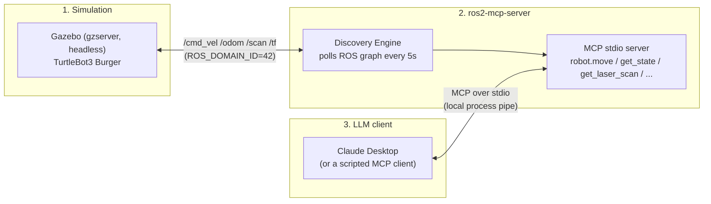

# Execution Guide

Step-by-step instructions to bring the full stack up — simulation → `ros2-mcp-server`
→ LLM client — with the verification performed at each step and what was actually
observed on this host. Architecture/design lives in [`docs/`](docs/00-overview.md) and
[`README.md`](README.md); this file is the runbook.

## System at a glance



Both processes must agree on `ROS_DOMAIN_ID` (this setup uses **42**, matching
`~/.config/Claude/claude_desktop_config.json`) — different domains means the server
and the simulator simply never see each other on the ROS graph, with no error, just an
empty capability list.

## Step 1 — Launch the simulation

```bash
source /opt/ros/humble/setup.bash
source /home/darshan/turtlebot_ws/install/setup.bash
export ROS_DOMAIN_ID=42
export TURTLEBOT3_MODEL=burger
ros2 launch turtlebot3_gazebo turtlebot3_world.launch.py
```

Run headless where possible (see [Known issues](#known-issues--flakiness)) — either
kill the `gzclient` GUI process after launch, or launch `gzserver` directly. The GUI
buys nothing for MCP interaction; every topic is published by `gzserver` alone.

**Verification:**

```bash
export ROS_DOMAIN_ID=42
ros2 topic list
```

Expect: `/cmd_vel`, `/odom`, `/scan`, `/tf`, `/tf_static`, `/imu`, `/joint_states`,
`/camera/image_raw` (no publisher on the `burger` model — see
[Known limitations](#known-limitations)).

```bash
ros2 topic hz /odom --window 5
```

Expect ~30 Hz, confirming physics is actually stepping and publishing, not just that
the node graph exists.

✅ **Observed:** all topics present; `/odom` at ~29–30 Hz.

## Step 2 — Run ros2-mcp-server

**Prerequisites verified once, before first run:**

| Check | Command | Result |
|---|---|---|
| Unit tests | `python3 -m pytest tests/ -q` | **133 passed** |
| Type check | `MYPYPATH=src python3 -m mypy -p ros_mcp` | **Success, no issues** |
| Protocol conformance | `MYPYPATH=src:tests python3 -m mypy -p tests.typecheck.protocol_conformance` | **Success** |

Two real bugs were fixed to get here (see [Fixes applied](#fixes-applied-this-session)):
an outdated system `Pillow` missing `Image.Resampling`, and a missing `await` in
`resource_provider.py`'s `robot://state` resource read.

**Launch — via Claude Desktop (production path):**

`~/.config/Claude/claude_desktop_config.json` already has:
```json
"ros-mcp-server": {
  "command": "/home/darshan/ros2-mcp-server/examples/run_server.sh",
  "env": { "ROS_DOMAIN_ID": "42", "TURTLEBOT3_MODEL": "burger" }
}
```
Restart Claude Desktop (or toggle the `ros-mcp-server` entry off/on in its MCP
settings) so it spawns a fresh connection.

**Launch — standalone (for manual testing):**
```bash
cd /home/darshan/ros2-mcp-server
ROS_DOMAIN_ID=42 ./examples/run_server.sh
```

**Verification:**

The server logs one line on startup:
```json
{"message": "discovery complete: N capabilities registered"}
```
`N=0` on the very first poll is normal if the sim isn't up yet, or if this rclpy node
was just created — DDS discovery takes a moment after node creation. Discovery
re-polls every 5s in the background, so it self-corrects within a few seconds; no
restart needed.

✅ **Observed (sim already running):** `discovery complete: 4 capabilities registered`
— `differential_drive_motion`, `range_sensing`, `object_detection`,
`visual_observation` (camera capability is *discovered*, i.e. the topic exists, even
though `burger` never actually publishes to it — see
[Known limitations](#known-limitations)).

⚠️ **Also observed:** Claude Desktop's own pre-existing connection had crashed
(`ExternalShutdownException` killed the ROS executor thread, no auto-recovery) —
required a Desktop restart to pick up a live connection. `src/ros_mcp/ros/executor_thread.py`
has no crash handling around `spin_once`; worth hardening if this recurs.

## Step 3 — Interact via the LLM

**Via Claude Desktop:** just chat — "move the robot forward 1 meter", "what does the
laser scan show", "stop the robot".

**Via the repo's scripted client** (drives the exact same MCP stdio transport Desktop
uses, without needing the Desktop GUI):
```bash
cd /home/darshan/ros2-mcp-server
source /opt/ros/humble/setup.bash
export ROS_DOMAIN_ID=42
export ROS_MCP_BASE_FRAME=base_footprint
python3 acceptance/live_client.py --phase no_nav2
```

### Verification — acceptance run against the live sim

| # | Criterion | Result | Detail |
|---|---|---|---|
| 1 | `get_state` | ✅ PASS | pose returned, fresh |
| 2 | `get_capabilities` (no Nav2) | ✅ PASS | navigation correctly absent, degrades cleanly |
| 3 | `get_laser_scan` | ✅ PASS | sectors populated, not stale |
| 4 | `move(forward, 1.0m)` accuracy | ✅ PASS | 3.8 cm error (well under the project's own 10 cm bar) |
| 5 | `stop` latency | ✅ PASS | 539 ms |
| 8 | move exceeding `max_move_distance_m` → `SAFETY_REJECTED` | ✅ PASS | **zero** `/cmd_vel` published |
| 9 | `get_camera_image` | ⚠️ expected fail | `burger` has no camera hardware — `SENSOR_STALE`, not a crash (see below) |

### Additional manual verification (velocity + scan focus, camera set aside per request)

| Check | Result |
|---|---|
| `move forward` / `backward` | ✅ real closed-loop motion, accurate to a few cm |
| `move rotate_left` / `rotate_right` (90°) | ✅ accurate to ~0.3–0.6° |
| `move left` (lateral) | ✅ succeeded into open space |
| `robot.stop` mid-motion | ✅ cancels in-flight move, zeroes velocity |
| `get_laser_scan` before/after motion | ✅ live, sector ranges update correctly as the robot moves |
| Safety obstacle rejection | ✅ `robot.move` correctly refused when the *live scan* showed an obstacle inside `obstacle_stop_distance_m` (0.3 m) — proves scan + safety + motion are genuinely wired together, not just individually working |
| Dead-reckoning to an absolute `(x, y)` (no Nav2) | ✅ rotates to face target, drives straight, safety-stops cleanly short of a real wall in the way — correct behavior for a system with no path planner |

## Known limitations

- **No camera on `burger`** — `robot.get_camera_image` is discovered (topic exists)
  but never receives data, so every call returns a typed `SENSOR_STALE` error, not a
  crash. This is a model choice (`TURTLEBOT3_MODEL=burger` in Desktop's config), not a
  code defect. Switch to `turtlebot3_burger_cam` for a model with a camera.
- **No Nav2/AMCL running in this session** — `robot.navigate` and absolute-coordinate
  goals aren't available; only relative `robot.move` (straight-line dead reckoning,
  computed client-side from `robot.get_state`). The robot cannot route *around*
  obstacles, only detect and stop short of them.

## Known issues / flakiness

**Transient `SENSOR_STALE` on a command issued immediately after a previous one
completes.** Reproduced a handful of times, always as the very next command with no
gap, never mid-session with natural pacing. `odom_stale_s` (config default: 0.5 s) is
generous against `/odom`'s actual ~30 Hz rate, so this points to real OS-level
scheduling jitter on a loaded, multi-process dev box (Gazebo + Docker containers +
IDEs + Electron apps) rather than a logic bug — confirmed Gazebo's real-time factor
stayed ≈0.95 (not the cause) while system load average was elevated (~2.5–4.8 on 8
cores) from concurrent tooling.

**Mitigations that worked:**
- Run `gzserver` headless (kill `gzclient`) — cut CPU contention, made the flake
  noticeably rarer.
- A short retry-on-`SENSOR_STALE` (wait ~1s, retry) is a reasonable operational
  pattern for any automated client issuing rapid consecutive motion commands.
- If this needs to be rock-solid regardless of host load, consider raising
  `safety.odom_stale_s` in `config/robot.yaml`, or hardening
  `RclpyExecutorThread._run` to log/recover instead of a bare `spin_once` call.

## Fixes applied this session

| File | Issue | Fix |
|---|---|---|
| (host Python env) | System `Pillow` 9.0.1 predates `Image.Resampling` (added in 9.1), broke camera-thumbnail code and 2 unit tests | `pip install --user --upgrade Pillow` → 12.3.0 |
| `src/ros_mcp/mcp/resource_provider.py` | `robot://state` resource called `resolve_robot_state()` (now `async`) without `await` — returned an unawaited coroutine at runtime, real bug caught by `mypy` | Added `await`; threaded `tf_adapter`/`base_frame` through the constructor for parity with the `get_state` tool's live-TF fallback |
| `src/ros_mcp/server.py` | `DefaultResourceProvider` wasn't passed `tf_adapter`/`base_frame` | Wired through at construction |
